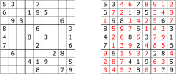
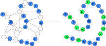

# ProteinSolver <!-- .element: style="margin-top: 16rem" -->

---

## Overview

- ProteinSolver   *Designing proteins that fold into a "pre-deterimined" 3D shape.*

  - Introduction
  - Methods
  - Results
  - Discussion

---

## Potein design problem formulation

- Find structural templates for 72 million Gene3D domain sequences in UniParc.

- Mask ~50% of the amino acids in the input sequence, and train the network to reconstruct the identities of the masked amino acids.

---

## Sudoku problem formulation

- Generate one million unique Sudoku puzzles using the [`sugen`](https://dlbeer.co.nz/articles/sudoku.html) program.

- Train the network to assign numbers to the empty squares in the starting Sudoku grid.

---

## Network architecture

---

## Learning to solve Sudoku puzzles

- The model achieves > 70% accuracy in filling missing numbers for "difficult" puzzles.

- Using an _incremental_ evaluation strategy, the model correctly solves > 90% of puzzles.

---

## Learning to reconstruct protein sequences

- The model reconstructs sequences with ~20% accuracy for the training dataset, ~30% accuracy for the validation dataset.
- The model generates entire sequences with ~27% accuracy.
- Oneshot and incremental strategies produce similar results.
- Including sequence context increases accuracy.

---

## Independent validation

---

## Generating novel proteins   (with specific geometries)

- **Serum albumin** — Mainly α. CATH superfamily: [1.10.246.10](http://www.cathdb.info/version/latest/domain/1n5uA03).

- **PDZ3 domain** — Mainly β. CATH superfamily: [2.30.42.10](http://www.cathdb.info/version/latest/domain/4z8jA00).

- **Immunoglobulin** — Mainly β. CATH superfamily: [2.60.40.10](http://www.cathdb.info/version/latest/domain/4unuA00).

- **Alanine racemase** — α + β. CATH superfamily: [3.20.20.10](http://www.cathdb.info/version/latest/domain/4beuA02).

^^^

### Serum albumin

- Mainly α.

- CATH superfamily: [1.10.246.10](http://www.cathdb.info/version/latest/domain/1n5uA03).

- Sequence identity between final design and reference structure: **42.4%**.

- E-value to closest match in the training dataset: **385.5**.

^^^

### PDZ3 domain

- Mainly β.

- CATH Superfamily: [2.30.42.10](http://www.cathdb.info/version/latest/domain/4z8jA00).

- No experimental validation obtained.

^^^

### Immunoglobulin

- Mainly β.

- CATH Superfamily: [2.60.40.10](http://www.cathdb.info/version/latest/domain/4unuA00).

- No experimental validation obtained.

^^^

### Alanine racemase

- Both α and β.

- CATH Superfamily: [3.20.20.10](http://www.cathdb.info/version/latest/domain/4beuA02).

- Sequence identity between final design and reference structure: **37.7%**.

- E-value to closest match in the training dataset: **7.177**.

---

## Web servers

<a href="http://sudoku.proteinsolver.org/">http://sudoku.proteinsolver.org/</a>

<a href="http://design.proteinsolver.org/">http://design.proteinsolver.org/</a>

---

## Limitations

- Fast and flexible design of novel proteins <ins>matching existing topologies</ins> using graph neural networks.

- Failed to generate stable proteins for topologies containing beta sheets.

- Limited comparison with purely sequence-based methods (e.g. transformers trained to reconstruct protein sequences).

- Limited utility in its current form.

- Our network is not achieving perfect accuracy even on Sudoku, which existing SAT solvers can solve in milliseconds.

- The training time is on the order of days when using a single GPU, and the inference time is on the order of seconds (especially if doing inference one residue at a time).

- The accuracy that ProteinSolver achieves on mutation ΔΔG and protein stability prediction is not state of the art.
  - This may change if we retune the final layers of the ProteinSolver network to those particular applications.

- Two of the four proteins that we synthesised did not fold. It seems likely that this is due to the presence of β-sheets...

- A protein with a given structure is much less useful than a protein with a given function.

---

## Future directions

- Explore how well the ProteinSolver network can predict edge attributes (e.g. distances between two residues).

- Introduce a notion of protein dynamics into the ProteinSolver model.
  - Proteins have many different conformations. Rather than using a single adjacency matrix, we could use a distribution over adjacency matrices to describe those conformations?
  - ProteinSolver should already have some concept of backbone flexibility, since adjacency matrices are transfered from proteins with 20% - 100% sequence identity to the query sequence.

- Apply the ProteinSolver network architecture to design proteins that bind to specific targets (Fan Shen).

- Apply the ProteinSolver network architecture to homology modelling.

- Add additional node and edge features as inputs to the network. In particular, the orientation of two residues with respect to one another seems like a promising feature.

- Explore other network architectures that may achieve higher accuracy and / or would be faster to train (evaluate the graph transformer network used by Ingraham et al. 2019).

- Try training an attention network, without any graph information, using all sequences in UniParc [Rives et al., 2019], and see how well the accuracy compares to ProteinSolver.
