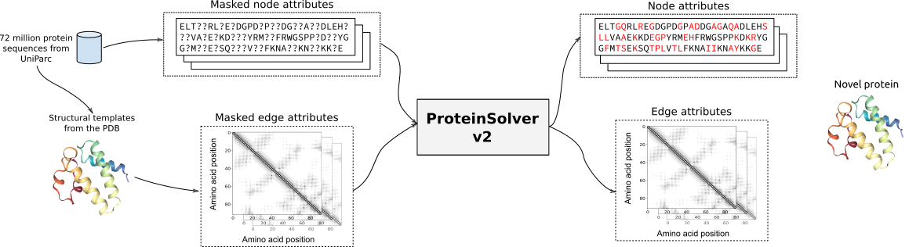
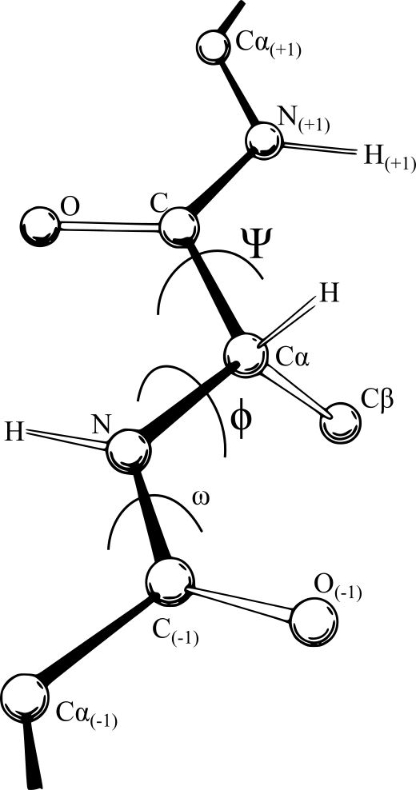
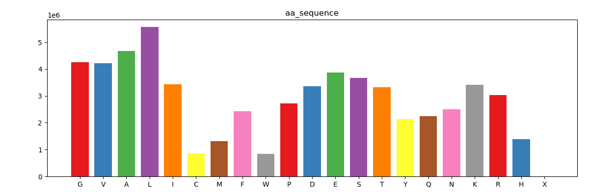
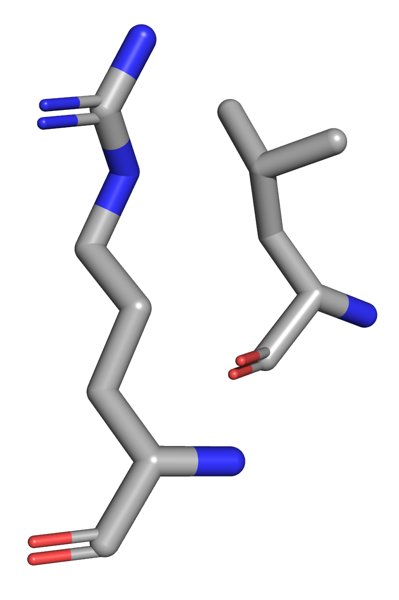
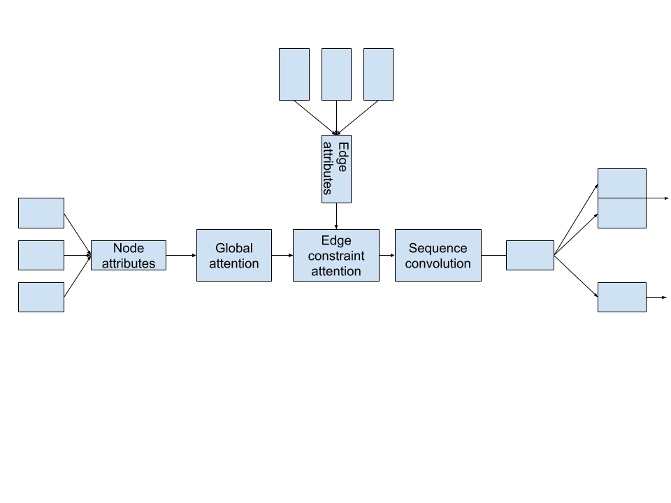
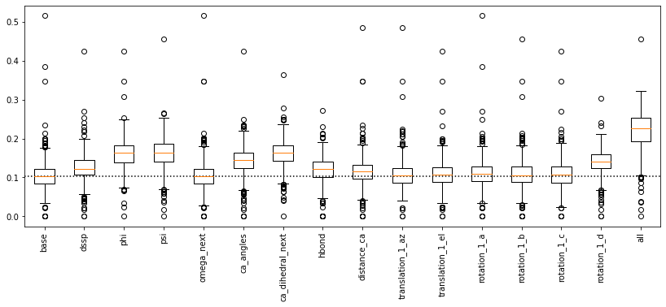
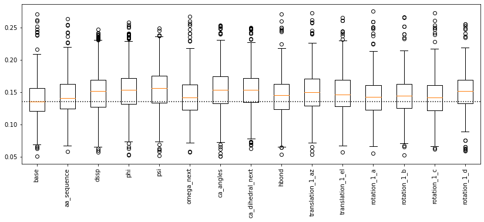

# ProteinSolver v2 <!-- .element: style="margin-top: 16rem" -->

---

## Overview

- ProteinSolver v2   _Learning a joint representation of protein sequence and structure._

  - General idea
  - Input data
  - Network architecture
  - Preliminary results
  - Summary

---

## General idea

---

## Input data

### Node attributes

- Amino acid sequence.

- Secondary structure.

- Backbone angles: φ (phi), ψ (psi), and ω (omega).

- Cα angles.

- Cα dihedral angles.

^^^

### Amino acids <!-- .element: class="h-attr" -->

^^^

### Secondary structure <!-- .element: class="h-attr" -->

^^^

### Phi angles <!-- .element: class="h-attr" -->

^^^

### Psi angles <!-- .element: class="h-attr" -->

^^^

### Omega angles <!-- .element: class="h-attr" -->

^^^

### Cα angles <!-- .element: class="h-attr" -->

^^^

### Cα dihedral angles <!-- .element: class="h-attr" -->

---

## Input data

### Edge attributes

- Distance between residues (backbone, Cα, nearest).

- Hydrogen bonds (structures protonated using `reduce`).

- Translations (in internal coordinates).

- Rotations (as quaternions).

^^^

<!-- .slide: data-background-iframe="https://eater.net/quaternions/video/doublecover" data-background-interactive -->

  <h2 style="color: #c7c7c7">Visualizing quaternions</h2>
  <a href="https://eater.net/quaternions/">https://eater.net/quaternions/</a>

^^^

### Distance between Cα atoms <!-- .element: class="h-attr" -->

^^^

### Hydrogen bonds <!-- .element: class="h-attr" -->

^^^

### Translation azimuth and elevation angles <!-- .element: class="h-attr" -->

^^^

### Rotation quaternions <!-- .element: class="h-attr" -->

---

## Network architecture

---

## Preliminary results

### Predicting node attributes

---

## Preliminary results

### Predicting edge attributes

---

## Summary

- ✔ Can predict edge attributes for all edges, even in large proteins.

- ❓ Combining multiple loss functions leads to a robust and generalizable model. Are multitask scoring functions any good?

- Compare model trained with all masking to models trained explicitly for the task at hand.

---

## Validation

- Compare the utility of the embedding learned by ProteinSolver with the embeddings learned by different transformer models—trained using sequence information only—on a variety of downstream tasks (TAPE). TAPE benchmark.

---

## Things to try in the immediate future

- Base off TAPE, like the Longformer

- Generate sequence and angles simultaneously.

---

## Future directions

- Protein folding — Predict phi, psi, omega angles given protein sequence (and possibly other information that can be gleaned from low-resolution experiments).

- Homology modelling — Predict phi, psi, omega angles given all other node and attribute features (using the amino acid sequence of the target protein).

---

## More future directions

- Add additional edge attributes which summarize protein motion (e.g. different NMR states or results of a molecular dynamics trajectory).

  - Presumably, we could then produce proteins that have the same dynamics and function as the target protein.

- Apply our model to protein docking (Fan Shen).
